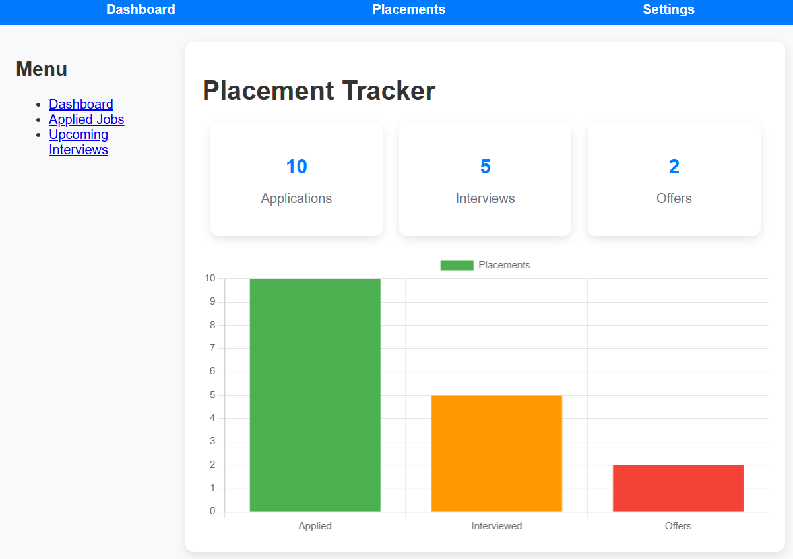

# Student Dash

Student Dash is a platform designed to help students track their on-campus and off-campus placements. It provides an intuitive dashboard that allows students to manage and track their application progress, job offers, and other placement-related activities.

## Features

- **Track On-Campus Placements**: Keep a record of all the on-campus placement events you are attending.
- **Track Off-Campus Placements**: Manage applications for off-campus opportunities.
- **Real-Time Updates**: Get notifications for important events, deadlines, and interview schedules.
- **Customizable Dashboard**: Personalize the dashboard based on your preferences.

## Tech Stack

- **Frontend**: React.js
- **Styling**: CSS, Tailwind

## Installation

### Clone the repository

```bash
git clone https://github.com/username/student-dash.git
cd student-dash
```

